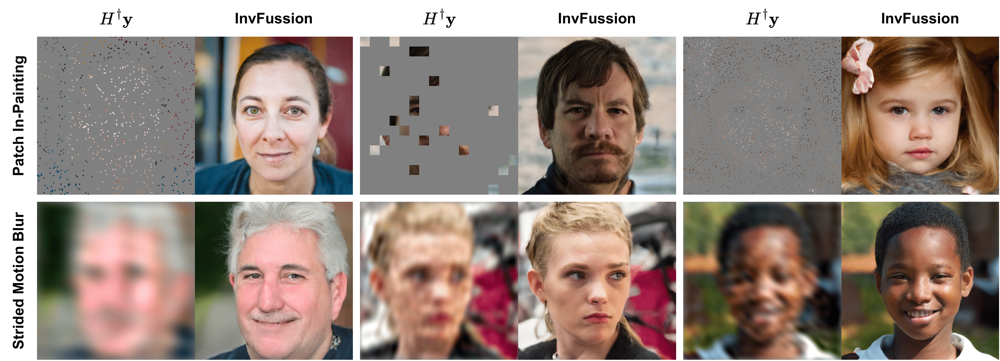

# InvFussion: Bridging Supervised and Zero-shot Diffusion for Inverse Problems Official PyTorch implementation

Noam Elata*, Hyungjin Chung*, Jong Chul Ye, Tomer Michali, Michael Elad 
https://arxiv.org/pdf/2504.01689 

Abstract: *Diffusion Models have demonstrated remarkable capabilities in handling inverse problems, offering high-quality posterior-sampling-based solutions. Despite significant advances, a fundamental trade-off persists, regarding the way the conditioned synthesis is employed: Training-based methods achieve high quality results, while zero-shot approaches trade this with flexibility. This work introduces a framework that combines the best of both worlds -- the strong performance of supervised approaches and the flexibility of zero-shot methods. This is achieved through a novel architectural design that seamlessly integrates the degradation operator directly into the denoiser. In each block, our proposed architecture applies the degradation operator on the network activations and conditions the output using the attention mechanism, enabling adaptation to diverse degradation scenarios while maintaining high performance. Our work demonstrates the versatility of the proposed architecture, operating as a general MMSE estimator, a posterior sampler, or a Neural Posterior Principal Component estimator. This flexibility enables a wide range of downstream tasks, highlighting the broad applicability of our framework. The proposed modification of the denoiser network offers a versatile, accurate, and computationally efficient solution, demonstrating the advantages of dedicated network architectures for complex inverse problems. Experimental results on the FFHQ and ImageNet datasets demonstrate state-of-the-art posterior-sampling performance, surpassing both training-based and zero-shot alternatives.*

## Code Coming Soon!